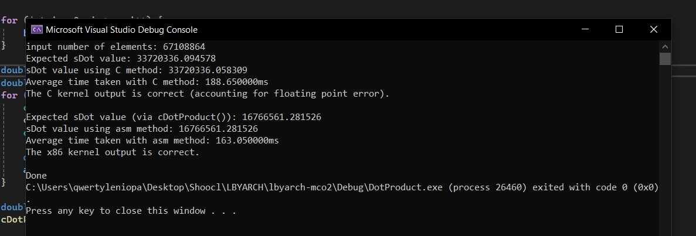

# LBYARCH x86-to-C Interface Programming Project

Pair:
- Clyde Julian Marindo
- Lenz Gio Rivera

Problem: Dot Product

## Execution Time Comparison and Analysis

| Mode         | Size  | C Time (ms) | x86 Time (ms) |
|--------------|-------|-------------|---------------|
| Debug Mode   | 2^20  | 3.500000    | 2.950000      |
|              | 2^24  | 49.250000   | 48.400000     |
|              | 2^26  | 192.450000  | 184.450000    |
| Release Mode | 2^20  | 2.900000    | 2.800000      |
|              | 2^24  | 45.900000   | 44.050000     |
|              | 2^26  | 178.800000  | 178.600000    |

(Each category was determined from an average of 20 runs.) 
(The computer used could only handle a maximum of 2^26 elements.)

As expected, the x86 kernel outperformed the C kernel in all cases, even in release mode. This indicates how bare-bones assembly is still more concise when executing operations as a whole despite the C kernel being wholly optimized by the compiler and no longer having debugger code attached to it in release mode. 

The C and x86 times were close for the 2^26-item release mode case, though another test (pictured below) showed a larger difference between the two. This shows that the two kernels can occasionally match each other in performance, though the x86 kernel would usually outperform the C one. 

## Kernel Testing Output

(The demo video is located in the root directory of the repo.)

The C Kernel is correct (accounting for floating point error). Likewise, the x86 Kernel is correct (based on the C Kernel output).
